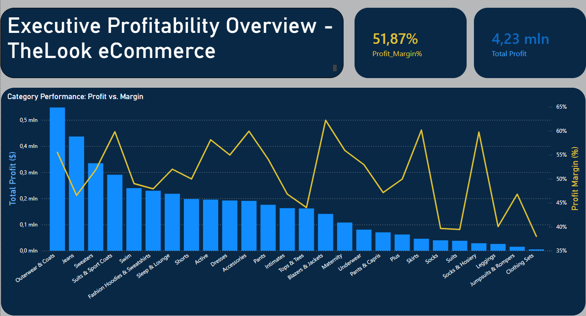

# Wprowadzenie. 
Postanowiłam zapisać tu wszystkie kroki, które wykonałam podczas stworzenia tego projektu. 

## 1. Przegląd zbioru danych: TheLook eCommerce, czyli Eksploracyjna Analiza Danych (EDA)

Projekt opiera się na publicznym zbiorze danych `thelook_ecommerce` w Google BigQuery. Jest to syntetyczny zbiór danych zawierający informacje o operacjach fikcyjnego sklepu odzieżowego online.

Aby uzyskać pełną listę dostępnych tabel i sprawdzić ich metadane, wykorzystano widok systemowy:

```
SELECT 
  table_name, 
  table_type, 
  creation_time
FROM 
  `bigquery-public-data.thelook_ecommerce.INFORMATION_SCHEMA.TABLES`;
  ```
  
  W celu wstępnej weryfikacji zawartości konkretnej tabeli (np. products), zastosowano zapytanie z ograniczeniem liczby wierszy, co pozwala na szybki podgląd próbek danych:
  
  ```
  SELECT * FROM `bigquery-public-data.thelook_ecommerce.products` LIMIT 10;
```

Baza danych składa się z 7 kluczowych tabel, które pozwalają na pełną analizę cyklu życia klienta oraz łańcucha dostaw:

| Nazwa tabeli | Opis zawartości | Kluczowe zastosowanie |
| :--- | :--- | :--- |
| **`users`** | Dane demograficzne klientów (imię, e-mail, wiek, płeć, lokalizacja GPS, miasto, kraj). | Analiza demograficzna i segmentacja klientów. |
| **`products`** | Katalog produktów zawierający nazwy marek, kategorie (np. Jeans, Suits), cenę detaliczną (`retail_price`) oraz koszt zakupu (`cost`). | Analiza asortymentu i obliczanie marży. |
| **`orders`** | Główne informacje o zamówieniach: status (Shipped, Returned, Cancelled), data utworzenia i liczba przypisanych przedmiotów. | Monitorowanie statusów realizacji i trendów sprzedaży w czasie. |
| **`order_items`** | Najbardziej szczegółowa tabela łącząca produkty z zamówieniami i użytkownikami. Zawiera ceny sprzedaży i daty zwrotów. | Obliczanie całkowitego przychodu, analiza zwrotów (Returns). |
| **`inventory_items`** | Stan magazynowy: informacje o tym, kiedy produkt trafił na stan i z którego centrum dystrybucji pochodzi. | Zarządzanie zapasami i analiza logistyczna. |
| **`events`** | Logi z aktywności na stronie (wejścia, kliknięcia, przeglądane produkty, dodanie do koszyka). | Analiza ścieżki zakupowej i współczynnika konwersji (UX/Marketing). |
| **`distribution_centers`** | Lista centrów logistycznych (nazwa oraz lokalizacja geograficzna). | Optymalizacja logistyki i dostaw. |

### Relacje między danymi
Wszystkie tabele są ze sobą powiązane za pomocą unikalnych identyfikatorów (kluczy):
* `user_id` łączy klientów z ich zamówieniami i aktywnością na stronie.
* `product_id` pozwala przypisać szczegóły produktu do konkretnej pozycji w koszyku.
* `order_id` grupuje wiele produktów w jedno zamówienie.

## 2. Cele biznesowe i pytania analityczne

Zanim przystąpiłam do analizy technicznej w SQL, zdefiniowałam główne cele biznesowe, które pomogą ocenić kondycję sklepu TheLook eCommerce. Moja analiza skupia się na trzech kluczowych obszarach:

### I. Rentowność i Asortyment (Profitability)
* **Cel:** Zidentyfikowanie najbardziej zyskownych kategorii produktów.
* **Pytanie biznesowe:** Które kategorie produktów generują największą marżę (różnica między ceną sprzedaży a kosztem zakupu)?
* **Kluczowe metryki:** Total Profit, Profit Margin per Category.

### II. Efektywność Marketingowa (Customer Acquisition)
* **Cel:** Ocena wartości klientów w zależności od źródła ich pozyskania.
* **Pytanie biznesowe:** Które źródło ruchu (`traffic_source`) sprowadza klientów o najwyższej średniej wartości zamówienia (AOV)?
* **Kluczowe metryki:** Average Order Value (AOV), User Count per Source.

### III. Optymalizacja Operacyjna (Returns Analysis)
* **Cel:** Zmniejszenie strat wynikających ze zwrotów towarów.
* **Pytanie biznesowe:** Które marki lub kategorie produktów charakteryzują się najwyższym współczynnikiem zwrotów?
* **Kluczowe metryki:** Return Rate (%), Total Returns.

---------------------------------------------------------------
## 3.I. Transformacja i Agregacja Danych (SQL)

### Notatnik techniczny: Analiza Rentowności
**Zadanie:** Obliczenie zysku i marży procentowej dla każdej kategorii i marki.
**Logika:** - Połączyłam tabele `products` i `order_items`.
* Wykluczyłam zamówienia anulowane i zwrócone, aby uzyskać realny obraz finansowy.
* Obliczyłam marżę jako `(Suma Cena - Suma Koszt) / Suma Cena *100%`.
* Wszystkie sumy są zaokrąglone do 2 miejsc po przecinku ROUND(...,2), ponieważ cena nie może być inna
* Sortujemy od najwyższego zysku, aby zobaczyć, jakiego rodzaju produkty przynoszą największą marże

```
SELECT 
  p.category AS kategoria,
  p.brand AS marka,
  ROUND(SUM(p.retail_price), 2) AS przychod_razem,
  ROUND(SUM(p.cost), 2) AS koszt_razem,
  ROUND(SUM(p.retail_price - p.cost), 2) AS zysk_razem,
  ROUND(SAFE_DIVIDE(SUM(p.retail_price - p.cost), SUM(p.retail_price)) * 100, 2) AS procent_marzy
FROM `bigquery-public-data.thelook_ecommerce.products` AS p
JOIN `bigquery-public-data.thelook_ecommerce.order_items` AS oi 
  ON p.id = oi.product_id
WHERE oi.status NOT IN ('Cancelled', 'Returned') -- Liczymy tylko faktyczną sprzedaż
GROUP BY 1, 2 -- (lub GROUP BY p.category, p.brand)
ORDER BY zysk_razem DESC
```
  
  **Wynik został zapisany jako widok (Save View), który można odczytać w Power Query**

Zamiast przesyłać miliony wierszy surowych danych do Power BI, wykonałam agregację po stronie BigQuery. Przygotowałam dedykowany widok SQL, który przelicza marżę na poziomie kategorii i marki, co optymalizuje czas odświeżania raportu.

## 4.I. Prezentacja danych w Power Bi
### Proces ETL i przygotowanie danych w Power Query
Po nawiązaniu połączenia między bazą BigQuery a Power BI Desktop, dane zostały zaimportowane do edytora Power Query. 

Kolejnym krokiem była weryfikacja jakości danych przy użyciu narzędzi dostępnych w zakładce Widok (Profilowanie danych), co pozwoliło na wyciągnięcie następujących wniosków:

  * **Jakość danych**: Nie zaobserwowano błędów ani pustych wartości (null) w kluczowych kolumnach.

  * **Poprawność finansowa**: W kolumnach przychod_razem, koszt_razem oraz zysk_razem wartości minimalne i maksymalne są większe od zera, co potwierdza logiczną spójność danych sprzedażowych.

  * **Wskaźniki rentowności**: Wartości w kolumnie procent_marzy mieszczą się w przedziale 36.9% – 65.7%, co jest wynikiem realistycznym dla analizowanego modelu biznesowego.

  * **Optymalizacja modelu (Star Schema)**: * Kolumna kategoria zawiera 25 powtarzających się wartości odrębnych (0 unikatowych).

      * Kolumna marka charakteryzuje się znacznie większą kardynalnością (431 wartości unikatowych).

      * **Decyzja projektowa**: Ze względu na to, że silnik kolumnowy VertiPaq (wykorzystywany przez Power BI) znacznie wydajniej przetwarza liczby niż długie ciągi tekstowe, podjęto decyzję o znormalizowaniu modelu. Dane dotyczące kategorii i marek zostały przeniesione do osobnych tabel wymiarów, co zoptymalizowało wydajność analizy.

### Modelowanie danych

Po wyodrębnieniu tabel wymiarów (`Kategoria` oraz `Marka`) i przypisaniu im kluczy głównych, zostały one połączone z tabelą faktów relacją jeden do wielu (1:*). Poniższy schemat przedstawia strukturę modelu:


### Implementacja miar DAX
W celu przeprowadzenia rzetelnej analizy rentowności, stworzono trzy kluczowe miary:
  1. **Total Profit**(Sumaryczny zysk firmy):
    
  $$Total Profit = SUM(Fakt_table[zysk_razem])$$

  2. **Total Revenue**(Sumaryczny przychód firmy):
    
  $$Total Revenue = SUM(Fakt_table[przychod_razem])$$

  3. **Profit Margin %**(Procentowy stosunek zysku do przychodu):
  
  $$Profit_Margin% = DIVIDE([Total Profit],[Total Revenue],0)$$

### Wizualizacja danych i wnioski
Pierwotna koncepcja zakładała użycie wykresu bąbelkowego (bubble chart), gdzie oś X stanowiły kategorie, oś Y – Total Profit, a wielkość bąbelka odpowiadała marży.  
  

  Jednak przy 25 kategoriach wykres stał się nieczytelny – znaczniki nakładały się na siebie, a etykiety osi były ucięte. Aby poprawić przejrzystość, zmieniono typ wizualizacji na wykres kombi (Line and stacked column chart). W tej konfiguracji słupki reprezentują zysk kwotowy (oś Y), a linia pokazuje rentowność procentową (oś pomocnicza Y).
  
W projekcie świadomie zastosowano teorię koła kolorów, aby nadać raportowi profesjonalny charakter:
- **Blue (Primary):** Wykorzystany dla słupków (Total Profit) jako kolor budujący zaufanie i czytelność struktury.
- **Gold/Yellow (Accent):** Kolor dopełniający dla linii (Profit Margin %), pozwalający na błyskawiczną identyfikację anomalii rentowności na tle wolumenu zysku.
- **Dark Mode:** Ciemne tło zostało wybrane w celu zminimalizowania zmęczenia wzroku i uwydatnienia nasycenia barw kluczowych metryk.


## Końcowy dashboard 

Ostateczny wynik prac to interaktywny dashboard, który łączy szczegółową analizę kategorii z ogólnymi wskaźnikami efektywności (KPI). Dzięki zastosowaniu kart z sumarycznymi wynikami, odbiorca może błyskawicznie ocenić globalną kondycję finansową przed przejściem do analizy poszczególnych asortymentów.



---------------------------------------------------------------

## 3.II. Transformacja i Agregacja Danych (SQL)


**Zadanie**: Analiza wartości klienta (LTV) i jakości ruchu (AOV, Zwroty) według źródła pozyskania.
**Logika**:

  * **Połączenie danych**: Połączyłam tabelę users (źródło ruchu) z order_items (sprzedaż), aby przypisać przychód do konkretnych kanałów marketingowych.

  * **AOV (Average Order Value)**: Obliczyłam jako sumę sprzedaży podzieloną przez unikalną liczbę zamówień (DISTINCT order_id). To pozwala sprawdzić, gdzie klienci robią najwięcej "ładowanych" koszyków.

  * **Monitoring zwrotów**: Wykorzystałam agregację warunkową (CASE WHEN), aby policzyć stopę zwrotów (Return Rate). Pozwala to ocenić, czy dany kanał nie sprowadza klientów "problemowych", którzy generują koszty logistyczne.

  * **LTV (Customer Lifetime Value)**: Obliczyłam jako całkowity przychód wygenerowany przez źródło podzielony przez liczbę unikalnych klientów. To kluczowa metryka mówiąca o tym, ile średnio wart jest dla firmy klient z danego kanału.

  * **Precyzja**: Zastosowałam ROUND(..., 2), aby zachować czytelność finansową i uniknąć błędów zaokrągleń przy walutach.

  * **Ranking**: Wyniki posortowałam według LTV malejąco, aby od razu wskazać najbardziej dochodowe źródła pozyskania klientów.

```
SELECT 
    u.traffic_source,
    COUNT(DISTINCT u.id) AS total_customers,
    
    -- 1. Średnia wartość zamówienia (AOV)
    ROUND(SUM(oi.sale_price) / COUNT(DISTINCT oi.order_id), 2) AS average_order_value,
    
    -- 2. Analiza zwrotów
    COUNT(DISTINCT CASE WHEN oi.status = 'Returned' THEN oi.order_id END) AS returned_orders_count,
    ROUND(
      COUNT(DISTINCT CASE WHEN oi.status = 'Returned' THEN oi.order_id END) / 
      COUNT(DISTINCT oi.order_id) * 100, 2
    ) AS return_rate_percent,
    
    -- 3. Customer Lifetime Value (LTV)
    ROUND(SUM(oi.sale_price) / COUNT(DISTINCT u.id), 2) AS customer_ltv

FROM 
    `bigquery-public-data.thelook_ecommerce.users` AS u
JOIN 
    `bigquery-public-data.thelook_ecommerce.order_items` AS oi 
    ON u.id = oi.user_id

GROUP BY 
    1
ORDER BY 
    customer_ltv DESC;
```

W wyniku przeprowadzonego zapytania wygenerowano tabelę podsumowującą kluczowe metryki efektywności kanałów marketingowych:


Kluczowe wnioski z analizy (Insights):

  * **Dominacja kanału Search**: Ponad połowa bazy klientów została pozyskana przez wyszukiwarkę, co czyni ją głównym filarem sprzedaży.

  * **Wysoka jakość ruchu Organic**: Kanał ten charakteryzuje się najwyższymi wskaźnikami AOV (średnia wartość zamówienia) oraz LTV (wartość życiowa klienta). Oznacza to, że klienci organiczni generują wyższe przychody i wykazują większą lojalność w długim terminie.

  * **Stabilna stopa zwrotów**: Niezależnie od źródła ruchu, odsetek zwrotów utrzymuje się na stałym poziomie ok. 10%, co sugeruje, że źródło pozyskania nie ma wpływu na późniejszą rezygnację z zakupu.

  * **Retencja klientów**: We wszystkich kanałach wskaźnik LTV jest wyraźnie wyższy od AOV, co potwierdza, że średni klient powraca do sklepu na kolejne zakupy.

Przygotowanie danych pod dashboard Power BI
Aby umożliwić głębszą, interaktywną analizę, przygotowano dedykowaną tabelę szczegółową (tzw. flat table). Poniższy skrypt łączy dane o użytkownikach z ich zamówieniami, wzbogacając je o segmentację demograficzną:
```
SELECT 
    u.id AS user_id,
    u.traffic_source,
    u.country,
    u.gender,
    u.age,
    -- Dodajemy przedział wiekowy już na poziomie SQL, żeby ułatwić tworzenie filtrów w PBI
    CASE 
      WHEN u.age < 25 THEN '18-24'
      WHEN u.age BETWEEN 25 AND 44 THEN '25-44'
      WHEN u.age BETWEEN 45 AND 60 THEN '45-60'
      ELSE '60+' 
    END AS age_group,
    oi.order_id,
    oi.sale_price,
    oi.status,
    oi.created_at
FROM 
    `bigquery-public-data.thelook_ecommerce.users` AS u
JOIN 
    `bigquery-public-data.thelook_ecommerce.order_items` AS oi 
    ON u.id = oi.user_id;
```
Tak przygotowany zbiór danych pozwala na dynamiczne badanie wskaźników AOV i LTV w wielu wymiarach: nie tylko według źródła ruchu, ale również w zależności od wieku, płci oraz lokalizacji geograficznej użytkowników.
