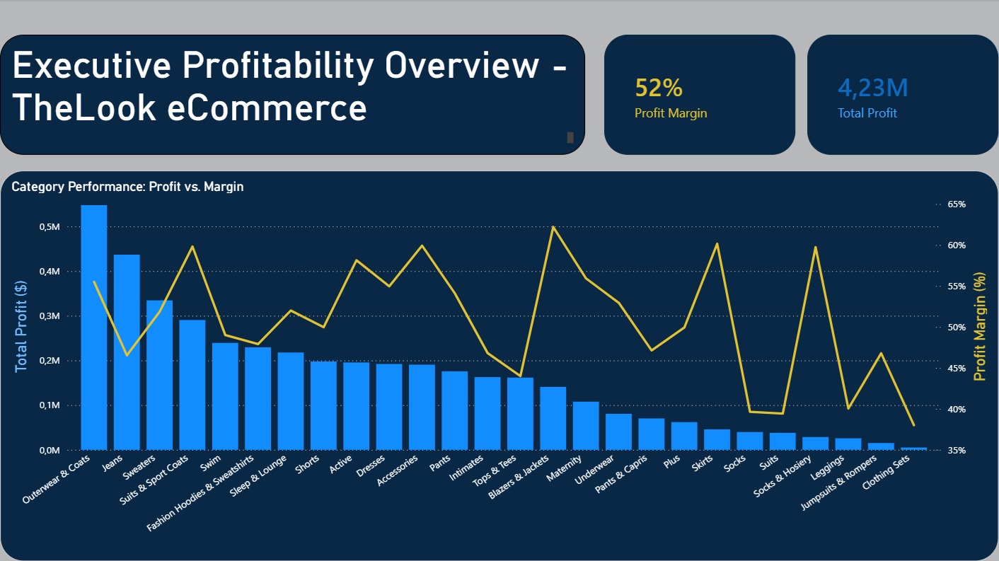
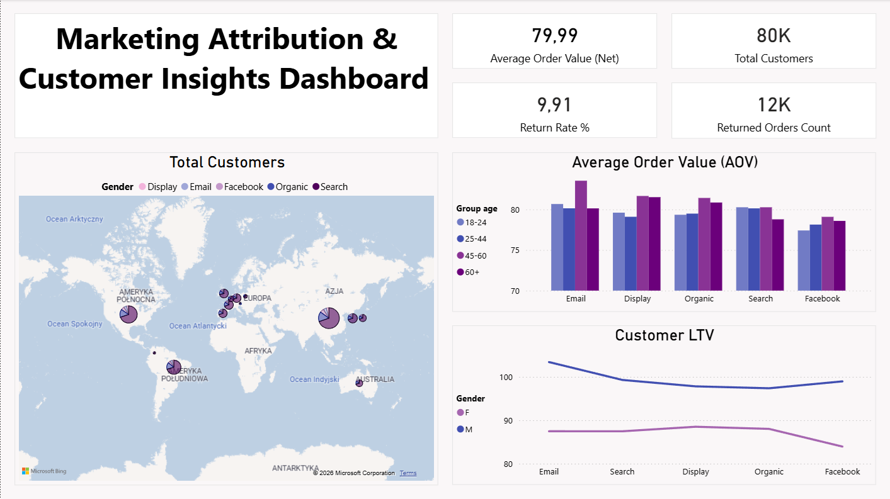
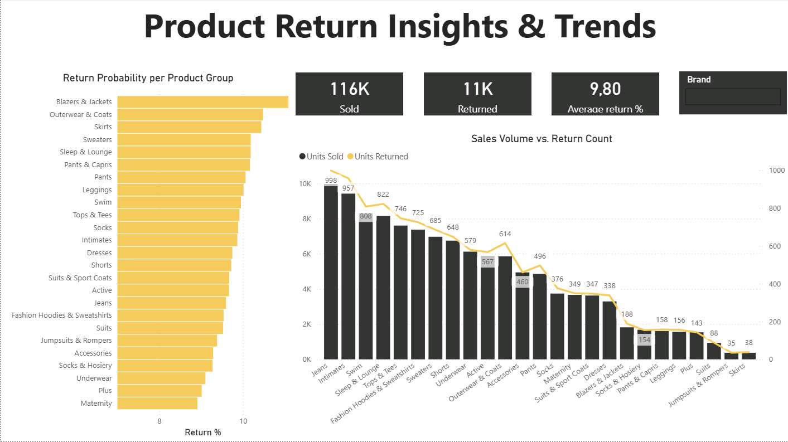

# Sales Analysis: TheLook eCommerce
## Tools Used
 * **Data Source**: Google BigQuery (`thelook_ecommerce`)
 * **Data Transformation**: SQL (BigQuery)
 * **Analysis & Visualization**: Power BI 

## Business Objectives & Analytical Questions
-----------------------------------------------------------
### I. Profitability & Inventory
* **Objective**: Identify the most profitable product categories.
* **Business Question**: Which product categories generate the highest margin (difference between sale price and cost)?
* **Key Metrics**: Total Profit, Profit Margin per Category.

### Key Business Insights:

-----------------------------------------------------------
### II. Marketing Effectiveness (Customer Acquisition)
* **Objective**: Evaluate customer lifetime value based on acquisition channels.
* **Business Question**: Which traffic source brings in customers with the highest Average Order Value (AOV)?
* **Key Metrics**: Average Order Value (AOV), User Count per Source.

### Key Business Insights:

-----------------------------------------------------------
### III. Operational Optimization (Returns Analysis)
* **Objective**: Reduce losses resulting from product returns.
* **Business Question**: Which brands or product categories exhibit the highest return rates?
* **Key Metrics**: Return Rate (%), Total Returns.

### Key Business Insights:
  * **Return Rate Stability**: The analysis reveals a remarkably consistent return rate across all product groups, mostly oscillating between 9.5% and 10.5%. This suggests that return drivers are systemic across the entire inventory rather than tied to specific category defects.

  * **Sales-Return Correlation**: There is a high correlation between sales volume and return count. This indicates that the rising number of returns is a direct result of increased sales scale, rather than a decline in product quality.

  * **High-Risk Categories**: Blazers, Jackets, and Outerwear show slightly higher return probabilities (above 10.5%), likely due to more complex sizing requirements for structured garments.

  * **Low-Return Segments**: The Maternity and Plus categories exhibit the lowest return rates, suggesting accurate sizing charts or higher purchase intent in these specialized segments.
-----------------------------------------------------------
